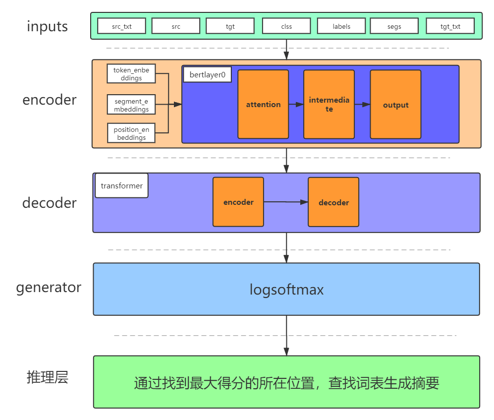
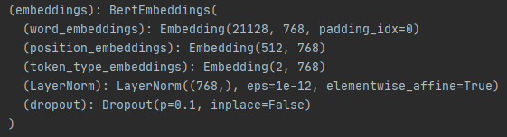
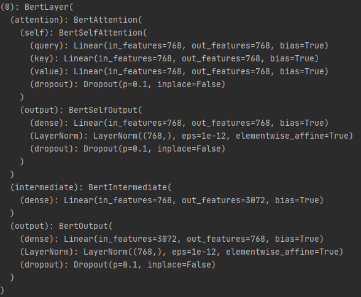

# 算法详解和使用

## 算法详解

*此部分的内容是对README3.1的补充*

通过观察数据集的摘要可知，摘要不是简单的从对应文本中抽取某一句话，而是对文本的总结，故抽取式的算法不适合本任务。在选择摘要生成式文本算法时，bertsumabs完美胜任此任务。Bertsumabs是以bert为基础构建的生成式文本摘要算法，其包括encoder层（bert）、decoder层（transformer）、generator层（linear）、推理层。

*图为bertsumabs整体架构*

### encoder层

encoder层是由bert模型构成，输入input_ids.shape = [batch_size, seq_length]。其输入表征如图所示：

bertbedding的模型结构：

bert的输入部分是个线性序列，两个句子通过分隔符分割，在句首增加[CLS]和句尾增加[SEP]，每个单词包含三个部分：（1）input_ids：Tokens （2）token_type_ids：segs （3）attention_mask：Position。

预训练模型：
Masked Language Model（MLM）：实现深度的双向表示，使得双向的作用让每个单词能够在多层上下文中间接的看到自己。
操作方法：通过训练数据生成器随机选择15%的文字，而不是始终用[MASK]替换所选单词，数据生成器执行以下操作：
* 80%的时间：用[MASK]标记替换文字，例如，今天天气很好-->今天天气很[MASK]。
* 10%的时间：用随机的文字替换该文字，例如，几天天气很好-->今天天气很急。
* 10%的时间：保持单词不变。

注：由于训练过程时，语料含有遮蔽的文字，而训练后将模型应用于实际任务时，语料没有遮蔽文字，故挑选10%的词。在随机替换时只有15% * 10%，因此不会严重破坏语言模型的理解能力。

*图为bert模型中Encoder的某一层*

输出有两种情况：
* 1、`output_layer = model.get_sequence_output()`，获取句子中每一个单词的向量表示，输出shape是[batch.size, seq.length, embedding.size]，这里也包括[CLS]。本次选用的输出方式。
* 2、`output_layer = model.get_pooled_output()`，这个输出是获取句子的output，既上述[CLS]的表示，输出shape是[batch.size, enbedding.size]。
* 目的：通过bert预训练模型，可以得到文本语境下的字向量或者句子向量。

例如：Tokens：['这' '是' '一' '个' '例' '子' '。' '一' '共' '两' '句' '话'  ' ' ' ' ' ' ' '。']，通过加入分隔符可得`[CLS] 这 是 一 个 例 子 [SEP] 一 共 两 句 话 [PAD] [PAD] [PAD] [SEP]`。输入的三个部分表示：

1、input_ids：[0, 1, 2, 3, 4, 5, 6, 7, 3, 9, 10, 11, 12, 13, 13, 13, 14]

2、token_type_ids：[0, 0, 0, 0, 0, 0, 0, 0, 1, 1, 1, 1, 1, 1, 1, 1, 1]

3、attention_mask：[1, 1, 1, 1, 1, 1, 1, 1, 1, 1, 1, 1, 1, 0, 0, 0, 1]

### decoder层

decoder层由transformer模型构成，Transformer作为seq2seq，由经典的Encoder-Decoder模型组成。Encoder层由6个block组成，Decoder层也由6个block组成，Decoder输出的结果经过一个线性层变换后，经过softmax层计算，输出最终的预测结果。

decoder层的输入shape为[batch.size, seq.length, enbedding.size]，输出shape为[batch.size, embedding.size]。

* 目的：通过decoder生成其文本的语义信息。

### generator层

generator层是由一个线性层经logsoftmax处理，经过LayerNorm后输出，其输入shape为[batch.size, embedding.size]，输出shape为[batch.size, vocab.size]。

* 目的：生成一个dim=0时大小为batch.size，dim=1时大小为vocab.size的向量。

### 推理层

推理层是对generator层的结果进行推理计算，生成合适的文本摘要。

generator层生成的向量在dim=0的维度上，选择最大的分数的那个和所在的位置号，通过预训练模型中的查找所对应的文字，在max_length的长度内进行文本生成。

* 链接：https://github.com/alebryvas/berk266

* 文章：KDD Converse 2020 paper: http://arxiv.org/abs/2008.09676

## 使用
使用过程中需要加载预训练模型，加载主要有三部分：
1、中文模型的词典表：../bert-base-chinese-vocab.txt
2、中文预训练模型的配置项：../bert-base-chinese-config.json
3、中文预训练模型：../bert-base-chinese-pytorch_model.bin 

*均在  https://s3.amazonaws.com/models.huggingface.co/bert 下载*